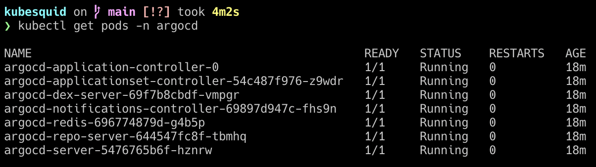

# Leverage Helm to deploy Argo CD to a minikube cluster.

### Instructions
1. Install Minikube and Helm using `brew`
2. start minikube
   `minikube start`
3. Add Argo CD helm repo to Helm.
    `helm repo add argo https://argoproj.github.io/argo-helm`

    `helm repo update`
4. Create kubernetes namespace where Argo CD will be deployed.
   `kubectl create namespace argocd`
5. can edit Argo CD values if want:
   1. Run  `helm show values argo/argo-cd` to see the available Helm chart values.
   2. Run `helm show values argo/argo-cd > argocd-values.yaml` to output Helm chart values for argocd to a new values yaml.
6. Deploy Argo CD using Helm chart; the command below installs Argo CD into the `argocd` namespace using the specified values file. 
   `helm install argocd argo/argo-cd -n argocd -f argocd-values.yaml`
7. Verify the deployment by checking the status of Argo CD and its kubernetes components to ensure everything is running correctly.
   `kubectl get pods -n argocd`
    
8. Access Argo CD UI locally by creating a port-forward from the local machine to the Argo CD service running in Minikube.
    `kubectl port-forward svc/argocd-server -n argocd 8080:443`
9. Naviage to `https://localhost:8080`. 
10. Sign in with credentials:
    1.  Username: `admin`
    2.  password: run the cmd locally `kubectl -n argocd get secret argocd-initial-admin-secret -o jsonpath="{.data.password}" | base64 -d && echo`

Argo CD is now deployed to Minikube cluster.