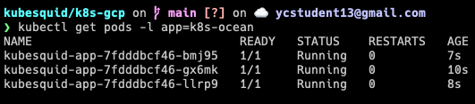
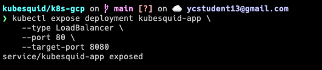
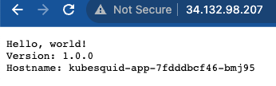

Steps to deploying a containerized, stateless web application to GKE:

### Pre-requisites
- a Google Cloud account

### Create a standalone standard GKE cluster
Follow instructions [here](https://cloud.google.com/kubernetes-engine/docs/how-to/creating-a-zonal-cluster). Once you're done, make sure it is up and running. 

### Deploy a stateless Linux application
1. Create a [Deployment manifest](_deployment.yaml) file.
2. `kubectl apply -f <PATH_TO_DEPLOYMENT_FILE>`
3. In the Deployment manifest, the 3 replicated pods are labelled `app=kubesquid-app`
  - To get information about Deployment, run `kubectl describe deployment kubesquid-app`

**Inspect the Deployment**
1. To get detailed info about the Deployment:
     - `kubectl describe deployment <DEPLOYMENT_NAME>`
2. To list the Pods created by the Deployment:
     - run `kubectl get pods -l <KEY=VALUE>`
       - the `l` instructs kubectl to get all pods with a specific key=value label
     - Output:  
3. To get information about a specific Pod:
    - `kubectl describe pod <POD_NAME>`
4. To view a Deployment's manifest:
   - `kubectl get deployments <DEPLOYMENT_NAME> -o yaml`

**Updating the Deployment**
- Roll out changes to a Deployment's Pod specification by making changes to the manifest file and applying them with `kubectl apply -f <DEPLOYMENT_NAME>`
  - the `-f` flag indicates the following argument is a file

**Changing the Deployment**
- To change the Pod specification's  `image`, `resources` (requests or limits), or `selector` fields:
`kubectl set image deployment <DEPLOYMENT_NAME> <IMAGE> <IMAGE:TAG>`

**Rolling back an update**
- `kubectl rollout undo deployment <DEPLOYMENT_NAME>`

**Scaling a Deployment manually**
- such as increasing number of replicas
  - `kubectl scale deployment <DEPLOYMENT_NAME> --replicas <NUMBER_OF_REPLICAS>`

### Expose the Deployment
- Expose the app to the internet so users can access it. 
- Kubernetes's `Service` exposes the app to external traffic.
  - `kubectl expose deployment kubesquid-app \
    --type LoadBalancer \
    --port 80 \
    --target-port 8080`
  -  
    - **To learn more about the flags:**
      - `--type LoadBalancer` creates a gce load balancer for the container.
      - `--port` initializes the external port 80 to the internet.
      - `--target-port` routes ingress traffic to the internal port 8080 of the pods.
  - Inspect kubesquid-app's Service by running `kubectl get serviec kubesquid-app`
    - From the command's output: copy the Service's external IP address from the EXTERNAL-IP column. Paste it into your web browser. 
      - 

**Flow of the traffic between the external and internal ports of the pods**
  1. Client initiates a request to the loadbalancer IP or hostname on port `80`.
  2. The load balancer receives the traffic and forwards it to the k8s cluster.
  3. the k8s Service (created by `kubectl expose` command) listens on port `80` within the cluster and acts as a stable endpoint for the application.
  4. The Service examines the incoming traffic and forwards it to the underlying pods associated with the Deployment (kubesquid-app).
  5. Inside the pods, the application (kubesquid-app) is listening on port `8080`. Therefore, the Service sends the incoming traffic to port `8080` inside the pods.
  6. The application (kubesquid-app) running inside each pod (of 3) receives the traffic on port `8080` and processes the request. 
  7. The response generated by the application is sent back through the same Service and LoadBalancer to the client that initiated the request.

**Cleanup**
Since load balancers in GCP are billed per Compute Engine's load balancer pricing, delete the kubesquid-app's Service to avoid incurring charges.