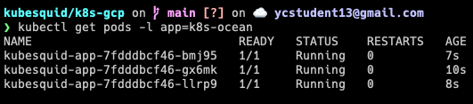

Steps to deploying a stateless application to GKE cluster:

### Create a standalone standard GKE cluster that has the bare minimum:
https://cloud.google.com/kubernetes-engine/docs/how-to/creating-a-zonal-cluster

Make sure it is up and running.

### Deploy a stateless Linux application
1. Create a [Deployment manifest](_deployment.yaml) file.
2. `kubectl apply -f <PATH_TO_DEPLOYMENT_FILE>`
3. In the Deployment manifest, the 3 replicated pods are labelled `app=kubesquid-app`
  - To get information about Deployment, run `kubectl describe deployment kubesquid-app`

**Inspect the Deployment**
1. To get detailed info about the Deployment:
     - `kubectl describe deployment <DEPLOYMENT_NAME>`
2. To list the Pods created by the Deployment:
     - run `kubectl get pods -l <KEY=VALUE>`
       - the `l` instructs kubectl to get all pods with a specific key=value label
     - Output:  
3. To get information about a specific Pod:
    - `kubectl describe pod <POD_NAME>`

4. To view a Deployment's manifest:
   - `kubectl get deployments <DEPLOYMENT_NAME> -o yaml`

**Updating the Deployment**
- Roll out changes to a Deployment's Pod specification by making changes to the manifest file and applying them with `kubectl apply -f <DEPLOYMENT_NAME>`
  - the `-f` flag indicates the following argument is a file

**Changing the Deployment**
- To change the Pod specification's  `image`, `resources` (requests or limits), or `selector` fields:
`kubectl set image deployment <DEPLOYMENT_NAME> <IMAGE> <IMAGE:TAG>`

**Rolling back an update**
- `kubectl rollout undo deployment <DEPLOYMENT_NAME>`

**Scaling a Deployment manually**
- such as increasing number of replicas
  - `kubectl scale deployment <DEPLOYMENT_NAME> --replicas <NUMBER_OF_REPLICAS>`