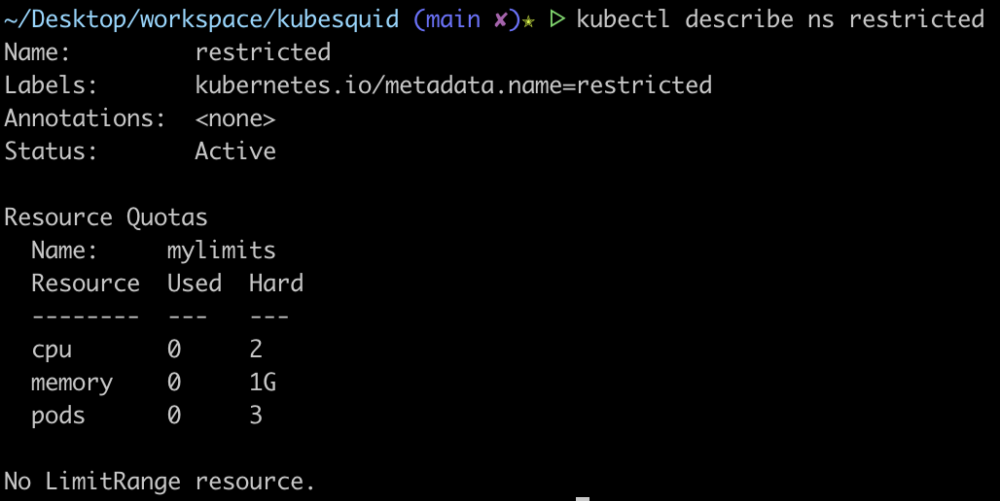
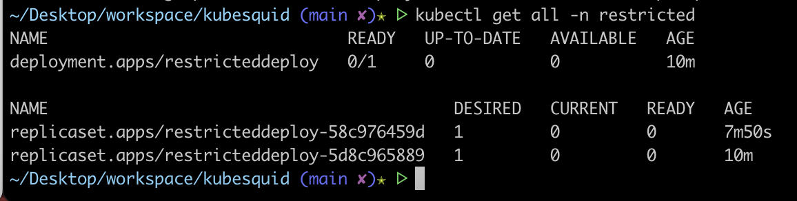
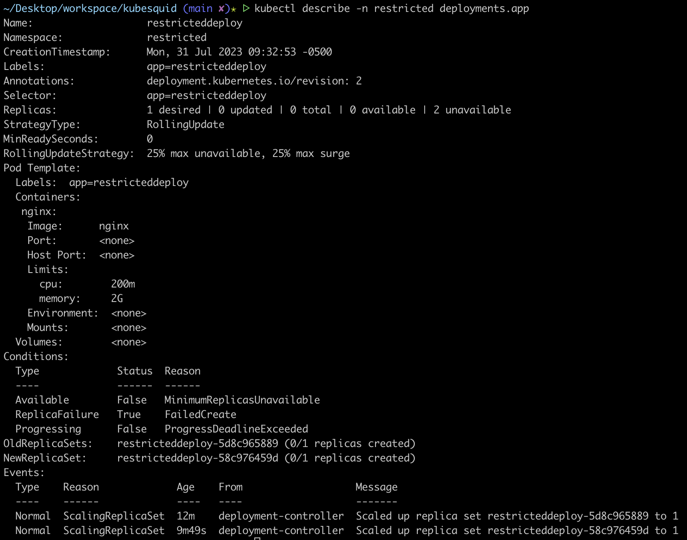

## Demo 2 : Using Quota on namespaces
`kubectl create ns restricted`
`kubectl create quota -h | less`
`kubectl create quota mylimits -n restricted --hard=cpu=2,memory=1G,pods=3` # set quota on namespace, "restricted"
`kubectl describe ns restricted`

`kubectl run pods restrictedpod --image=nginx -n restricted` 
    - `kubectl run` # this will create and deploy the pod 
IMPORTANT NOTE:
If a namespace has a quota, all of its resources must have quota as well (including the pods)
**Setting quota on Pod**...do it thru Deployment. Deployment is just a number of pods.
You can use `kubectl set` on Deployments (but not on Pods) to edit the resources.
`kubectl set resources deploy -h | less`
`kubectl set resources deploy restricteddeploy --limits=cpu=200m,memory=2G -n restricted`
`kubectl get all -n restricted`
`kubectl describe -n restricted deployments.app`

`kubectl describe -n restricted deployments.app`

`kubectl describe -n restricted replicasets.app` to view loggings for all replicasets or `kubectl describe -n restricted <replicaset-name>` to view loggings for a sepcific replicaset
Failures are due the resources defined to create the Pods exceed the quota that is set on the Deployment "restricteddeploy". 
To fix the error:
`kubectl set resources -n restricted deploy restricteddeploy --limits=cpu=200m,memory=128M --requests=cpu=100m,memory=64M`
`kubectl describe ns restricted`